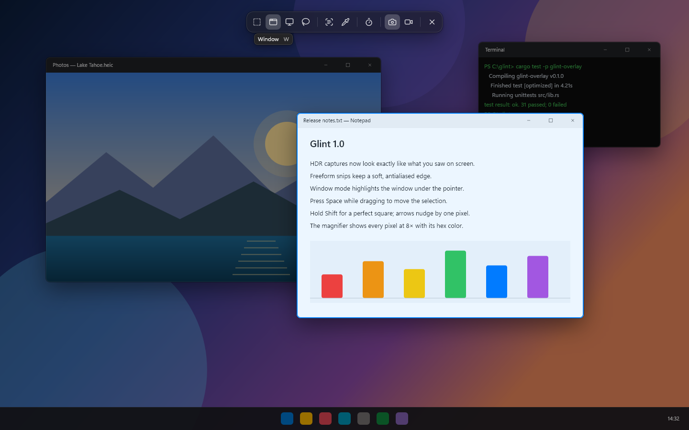
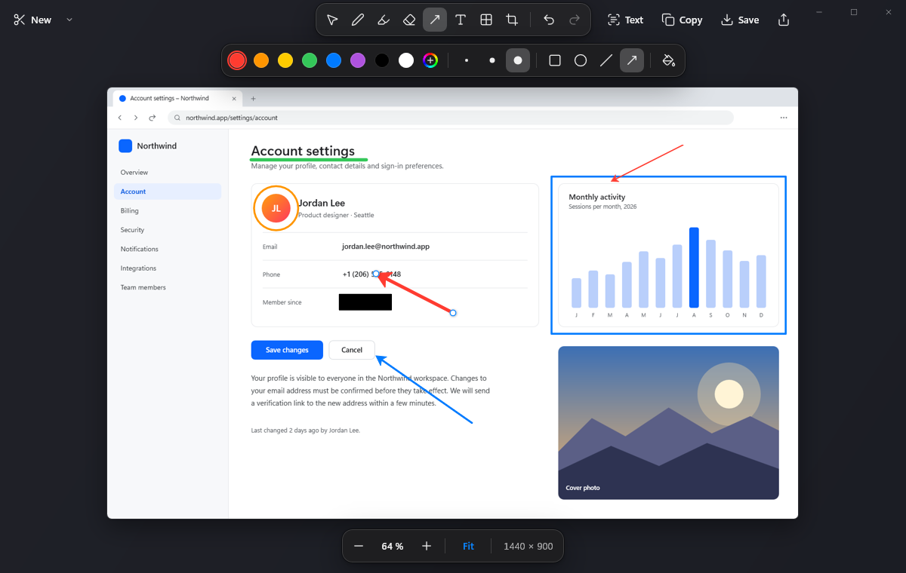
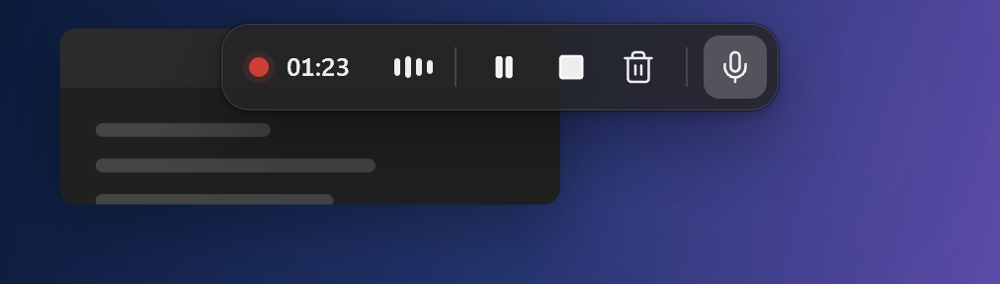

<p align="center"></p>

<h1 align="center">Glint</h1>

<p align="center">A screenshot and screen-recording tool for Windows 11 that replaces the Snipping Tool.<br>
Captures taken while HDR is on look exactly like what you saw: no washed-out greys, no blown highlights.</p>

<p align="center"></p>

## Why

With HDR enabled, Windows composes the desktop in linear scRGB. Most screenshot tools grab an 8-bit copy of that
or mis-read the 16-bit one, so screenshots come out grey and flat, or with clipped, neon highlights. Glint grabs the
16-bit frame, divides out your "SDR content brightness" setting and re-encodes with the sRGB curve, so ordinary
desktop content comes back pixel-for-pixel identical to SDR. HDR highlights (games, video, photos) are rolled off
with the BT.2390 curve instead of being clipped. Each snip is analysed on its own, so a region with only normal
content stays exact even when HDR video plays elsewhere on screen.

## Features

- **Capture modes:** rectangle, window, full screen (Ctrl+click for all monitors), freeform lasso, text (OCR to
  clipboard) and color picker; 3/5/10 s delay; pixel magnifier.
- **Shortcuts:** Win+Shift+S, Print Screen, Win+Shift+R (record), Win+Shift+T (text), Alt+Print Screen (active
  window straight to the clipboard).
- **After a capture:** copied to the clipboard, auto-saved to `Pictures\Screenshots`, floating thumbnail you can
  click to edit or drag into any app.
- **Editor:** pen with pressure, highlighter, eraser, shapes and arrows, text, blur/pixelate redaction, crop,
  select/move/resize, undo/redo, zoom, OCR text selection, copy/save/share, and an HDR panel to re-tone-map with
  exposure after the fact.
- **Screen recording:** region/window/monitor to MP4 (H.264 + AAC) with system audio and microphone, pause,
  and a recording bar that stays out of the video.
- **Settings:** grouped Apple-style preferences, light/dark themes, launch at login, install/uninstall.

<p align="center"></p>
<p align="center"></p>

## Install

Download `glint.exe` from the [latest release](../../releases/latest) (or build it, below), then in PowerShell:

```powershell
& .\glint.exe --install
```

This copies Glint to `%LOCALAPPDATA%\Programs\Glint`, starts it at login, adds a Start-menu entry and an
"Apps" uninstall entry, and takes over the Snipping Tool shortcuts. Nothing needs admin rights. Uninstall from the
settings window, from Windows "Apps", or with `glint --uninstall`. The Snipping Tool itself is never removed: when
Glint is not running, the shortcuts go back to Windows.

Limits: while an app running as administrator is in front, Windows does not pass shortcuts to non-elevated apps,
so the Snipping Tool answers there. Pen buttons and other `ms-screenclip:` launchers use Glint only after you pick it
once in Settings › Apps › Default apps (the settings window links there).

## Command line

```
glint                         start in the tray
glint --snip [rect|window|full|free|text|color]
glint --record                start the overlay in video mode
glint --edit <image>          open an image in the editor
glint --settings
glint --install | --uninstall | --quit
glint --selftest [--json]     headless checks (capture, tone mapping, OCR, rendering)
glint --preview <view> --out <png> [--theme dark|light] [--scale 1|2]
```

## Build

Requires Windows 10/11, the stable Rust MSVC toolchain and the Windows SDK (for `rc.exe`).

```powershell
cargo build --release -p glint-app      # target\release\glint.exe
cargo test --workspace
```

## Layout

| Crate | What it does |
|---|---|
| `glint-core` | Shared types, settings, HDR tone mapping, PNG/JPEG encoding |
| `glint-capture` | Monitors and HDR info, desktop duplication / Windows.Graphics.Capture / GDI capture, window list |
| `glint-ui` | Direct2D + DirectWrite + DirectComposition render kit, event loop, springs, widgets |
| `glint-sys` | Keyboard hook, tray, single instance, clipboard, dialogs, OCR, install |
| `glint-record` | Recording engine: capture, HLSL tone-map pass, Media Foundation H.264/AAC |
| `glint-overlay` | Frozen-screen selection overlay and countdown |
| `glint-editor` | Markup editor |
| `glint-app` | The `glint` binary: flows, thumbnail, settings, recording bar, CLI |

[DESIGN.md](DESIGN.md) is the full design spec, including the tone-mapping maths.

## Credits

Icons from [Lucide](https://lucide.dev) (ISC license) via the `icondata_lu` crate.

## License

[MIT](LICENSE)
